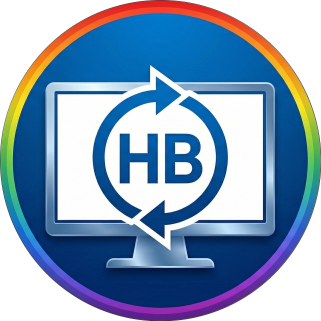
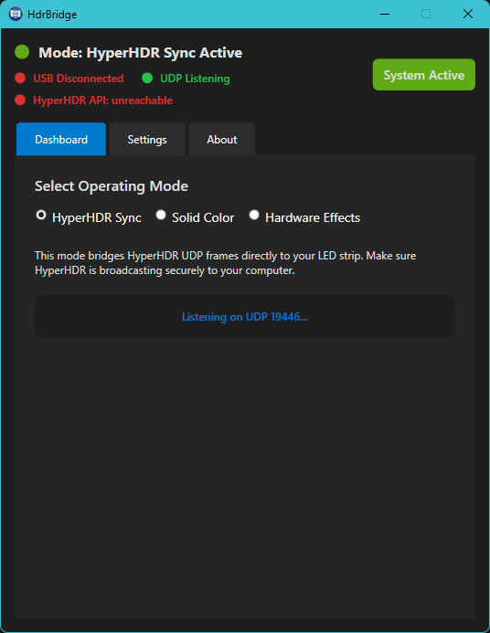

  

# 🌈 HdrBridge (HB)
  

**The missing link between budget USB-HID LED controllers and the professional HyperHDR ecosystem.**

A lightweight, native C# WPF application that bridges cheap proprietary USB LED strips (SyncLight / PC Screen Sync) with the professional open-source Ambilight ecosystem of **[HyperHDR](https://github.com/awawa-dev/HyperHDR)**.

  

---

## 🔍 Hardware Compatibility
This software is specifically designed for Chinese USB Ambilight kits that use the **HID protocol**.
* **VID:** `0x1A86` | **PID:** `0xFE07`
* **Common Brands:** Skydimo, SyncLight, Ambilight PC Kit.
* **Device Look:** Small controller with **3 physical buttons** (Static modes, Power, Music modes).

## 📖 Motivation: "Born out of frustration"
If you own this hardware, you know the pain: the official "SyncLight" app is resource-heavy, laggy, and often fails to capture HDR content. 

**HdrBridge** is a lightweight native C# replacement. We reverse-engineered the USB HID protocol (sniffing packets, cracking checksums, and handling remote interrupts) to give you a professional-grade experience. No more bloat, just pure performance.

## ✨ Key Features
* **🚀 Zero-Bloat:** Built with .NET 8, focusing on minimal CPU/GPU overhead.
* **🔘 Physical Remote Sync:** Unlike other apps, HdrBridge listens to your physical remote. Press "Power" on the cord, and the app automatically pauses HyperHDR streams.
* **🔧 Auto-Healing:** Robust USB monitoring — plug or unplug your device, and the bridge recovers instantly.
* **👻 Tray Resident:** Runs silently in the background with auto-start capability.
* **🎛️ Hardware Effect Control:** Trigger the strip's built-in hardware effects (Rainbow, Breathing, Static Colors) directly from the app.

## 🛠️ How It Works
1. **HyperHDR** captures your screen (DirectX/HDR) and sends RGB data via **UDP (port 19446)**.
2. **HdrBridge** intercepts the UDP stream, calculates the proprietary 332-byte chunks, and signs them with the required checksums.
3. **HID Communication:** The bridge fires raw commands to the controller, bypassing the need for any Chinese drivers.

## 🚀 Installation & Setup
1. Download `HdrBridge.zip` from the [latest Releases](../../releases).
2. Run `HdrBridge.exe` (Ensure **.NET 8 Desktop Runtime** is installed).
3. Set your **HyperHDR** output to `udpraw`, IP `127.0.0.1`, Port `19446`.
4. The app will automatically detect your LED strip and initialize it.
5. Enjoy a smooth, professional Ambilight experience.

### ⚙️ HyperHDR Configuration Details
In the HyperHDR web interface, set the LED Hardware as follows:
* **Controller Type:** `udpraw`
* **Target IP:** `127.0.0.1`
* **Port:** `19446`
* **Important:** Adjust the *Input Position* or *Reverse Direction* in the LED Layout settings to match your physical LED strip start.

> **Pro Tip:** For the best visual experience, go to HyperHDR's *Image Processing* tab, enable **Smoothing (Linear)**, and set the update frequency to ~50Hz.

---

## 🛠️ Node.js Alternative (Reference)
If you prefer a minimal CLI approach or need a code reference for the protocol, we've included `node_strip_test.js`. It is a bare-bones script that:
*   Initializes the USB device.
*   Starts a UDP server on port `19446`.
*   Directly forwards RGB data to the strip without UI or complex logic.

**How to run:**
1. Install [Node.js](https://nodejs.org/).
2. Install the HID dependency: `npm install node-hid`.
3. Run the script: `node node_strip_test.js`.

---

## 🤝 Contributing
Feel free to open issues or submit pull requests if you discover new hardware effect IDs or want to improve the UI!

## 📜 License
This project is licensed under the MIT License - see the [LICENSE](LICENSE) file for details.

*Developed with ❤️ by [GetTheNya](https://github.com/GetTheNya)*